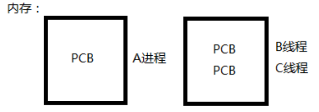

# **线程概述**

## **理解**

- LWP light weight process 轻量级的进程，本质仍是进程(在 Linux 环境下)
- ps -Lf <进程号>：查看当前进程下起的线程
- 线程id：在进程当中用来标识线程身份
- 进程可以蜕变为线程，这样原进程可以称之为主线程，之后创建的线程可以成为子线程
- 线程可以看作是寄存器和栈的集合
- 用线程相关的函数编译的时候要加 -pthread 编译选项

## **进程线程对比**

- **进程**

  - 有独立的 进程地址空间，有独立的PCB

  - 分配资源的最小单位

- **线程**
  - 有独立的PCB，没有独立的进程地址空间。
    - 有独立的PCB，但是PCB中完成物理内存资源映射的三级页表是相同的，因此物理资源是相同的
  - 最小的执行单位，CPU调度的最小单位
  
  

## **线程资源**

- **共享的资源**
  - 文件描述符表
  - 每种信号的处理方式
    - 对于一个进程中的所有信号，如果一个信号来了，哪个信号抢到则那个信号处理，处理方式是一样的
    - 不建议信号和线程混着用
  - 当前工作目录
  - 用户 ID 和组 ID
  - 内存地址空间 (.text/.data/.bss/heap/共享库)
  - 共享 全局变量
- **非共享**
  - 每个线程独享 栈空间（内核栈、用户栈）
  - 线程 id
  - 处理器现场和栈指针(内核栈)
  - 独立的栈空间(用户空间栈)
  - errno 变量
  - 信号屏蔽字
  - 调度优先级


## **线程优缺点**

#### **优点**

- 提高程序并发性 

- 开销小 

- 数据通信、共享数据方便

#### **缺点**

- 调试困难 

- 对信号支持不友好

## **进程线程相关函数对比**

```
线程控制原语					   进程控制原语
pthread_create()				fork();

pthread_self()					getpid();

pthread_exit()					exit();

pthread_join()					wait()/waitpid()

pthread_cancel()				kill()

pthread_detach()
```


## **注意事项**

- 主线程退出，其他线程不退出，应该用pthread_exit
  - 不能用exit、return
  - return：表示退出到调用该函数的位置，相当于结束了整个进程了，导致子线程也会结束
  - exit表示的是直接结束进程
- 避免僵尸线程，要注意回收
- 在线程中调用fork 的时候，如果之前一个进程有三个线程，fork是复制了进程内存空间，但是只有调用fork 的那个线程还存活，其余两个线程都死了。
  - 不推荐使用
- 不推荐线程和信号混合使用
  - 如果一个进程收到一个信号，该进程下面的所有线程都会去处理该信号，但是是谁抢到谁执行，所以就相对复杂
  - 所有线程的阻塞信号集是独立的，但是未决信号集是共享的。
